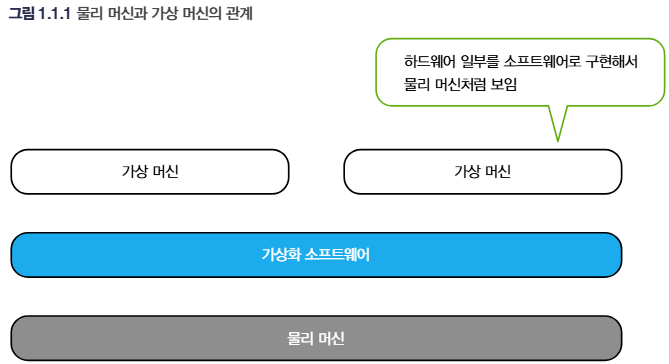
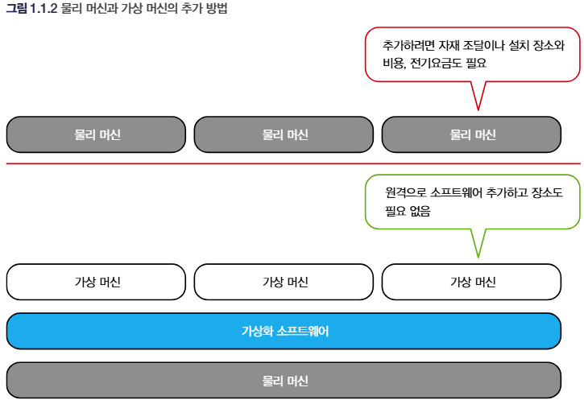
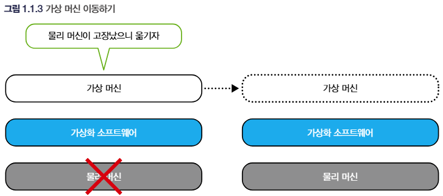

<h1>1. 물리 머신과 가상 머신</h1>
<ul> 
  <li>
    물리 머신(physical machine): CPU, 메모리, 스토리지 등의 <strong>하드웨어</strong>로 구성된 물리적인 컴퓨터 자체.
  </li>
  <li>
    가상 머신(virtual machine)
    <ul>
      <li>
        하드웨어 일부를 소프트웨어로 구현하여 <strong>마치 물리 머신인 것처럼</strong> 사용.
      </li>
      <li>
        가상 머신은 <strong>가상화 소프트웨어</strong>로 실행하고 관리.
      </li>
      <li>
        물리 머신의 성능이 가용 가능한 범위라면 <strong>다수의 가상 머신</strong>을 실행할 수 있다.
      </li>
    </ul>
  </li>
</ul>

  
  
그림 1. 물리 머신 위에 구현되는 가상 머신

  

<h2>1-1. 가상 머신 사용의 장점</h2>
<ul>
  <li>
    물리 머신을 활용하여 다수의 가상 머신을 구축할 수 있기에 <strong>저비용</strong>이다.
  </li>
  <li>
    물리 머신 성능 범위 내에서 <strong>소프트웨어 조작</strong>만으로 가상 머신을 추가할 수 있다. 이 경우 CPU와 메모리 등 하드웨어적인 비용 또한 <strong>소프트웨어로 설정 변경</strong> 만으로 구축이 끝난다.
  </li>
  <li>
    불필요한 경우 가상 머신을 단순히 <strong>삭제</strong>하는 것만으로 작업을 완료할 수 있다.
  </li>
  <li>
    소프트웨어를 통해 가상 머신을 설정한다. 따라서 다른 물리 머신에서도 소프트웨어에 설정된 값을 통해 가상 머신을 <strong>재사용</strong>할 수 있다.
  </li>
</ul>

  <!-- 첫 번째 이미지 -->
  

    
    
그림 2. 더 저렴한 가상 머신

  

  <!-- 두 번째 이미지 -->
  

    
    
그림 3. 가상 머신 재활용 구조

  

