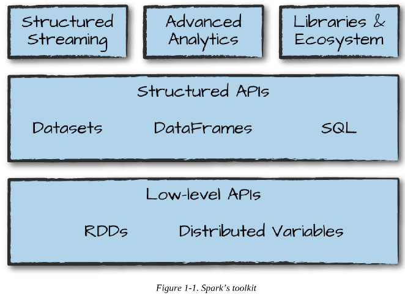

# Chapter 1. What Is Apache Spark
<ul>
  <li>
    Apache Spark는 <a href="#computer-clusters">computer clusters</a>에서 데이터 병렬 처리를 위해 사용되는 통합된 컴퓨팅 엔진이자 라이브러리들의 모음.
  </li>
  <li>
    유연한 확장성
    <ul>
      <li>다양한 언어(e.g. Python, Java, Scala, and R)에서 사용 가능.</li>
      <li>SQL과 ML을 포함한 다양한 라이브러리 포함.</li>
      <li>단일 labtop부터 수천개의 서버를 포함하는 클러스터에도 적용 가능.</li>
    </ul>
  </li>
  <li>
    하단의 그림처럼 Spark의 모든 측면에 대해서 배운다.  
    (하단의 이미지는 Spark가 end-users에게 제공하는 모든 componenets와 libraries이다).
     
    
  </li>
</ul>

  
# 용어 정리
#### computer clusters 
여러 대의 컴퓨터를 하나로 묶어 병렬 처리를 수행하는 시스템이다.

