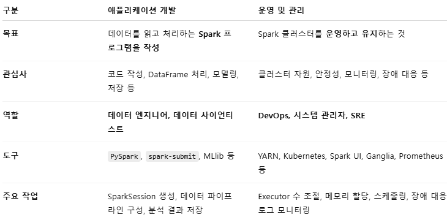

# 1. 도서의 핵심 구성 
1. Spark의 API와 라이브러리의 기능들 위주의 설명
    - 통계와 ML 설명은 포함되지 않음.

2. Spark의 애플리케이션 개발 중심 구조.
    - 운영 및 관리를 중점적으로 다루지 않음.
        

        
애플리케이션 vs 운영/관리

        

        

3. 새롭고 고수준적 API 중심 구조.
    - RDD 혹은 DStream 등의 저수준 API를 중점적으로 다루지 않음.

  

# 2. 실습 데이터와 코드 저장소 (Git)
https://github.com/databricks/Spark-The-Definitive-Guide